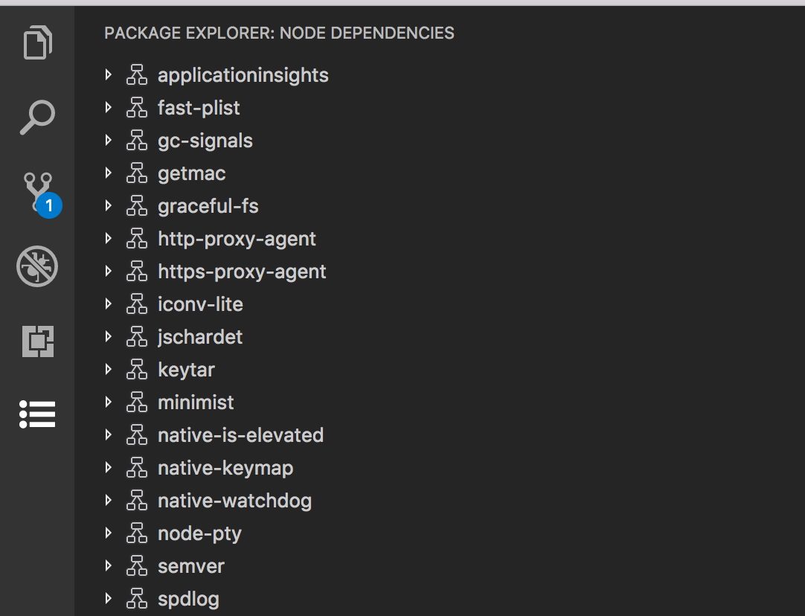

# Views & View Containers Modified to test for enablement of svg icons in view/title and view/editors command bars.

To underline the bug with disabled icons dimmed appearance, this code replaces the 'refresh' command on the ftp panel with four (4) versions of the refresh command icons, comparing enabled and disabled states of both _svg_, and _product-icon_ command icons appearance.

```JSON
			{
				"command": "ftpExplorer.refresh1",
				"title": "Refresh",
				"enablement": "!falsy",
				"icon": {
					"light": "resources/light/refresh.svg",
					"dark": "resources/dark/refresh.svg"
				}
			},
			{
				"command": "ftpExplorer.refreshDisabled1",
				"enablement": "falsy",
				"title": "Refresh Disabled1",
				"icon": {
					"light": "resources/light/refresh.svg",
					"dark": "resources/dark/refresh.svg"
				}
			},
			{
				"command": "ftpExplorer.refresh2",
				"title": "Refresh",
				"enablement": "!falsy",
				"icon": "$(refresh)"
			},
			{
				"command": "ftpExplorer.refreshDisabled2",
				"enablement": "falsy",
				"title": "Refresh Disabled2",
				"icon": "$(refresh)"
			},
```

This screenshot shows the changes on the left (adding the same refrersh icon but in a disabled state) followed with the refresh icons instead made with a 'product-icon' `$(refresh)` .


## The rest of this readme is the original readme for this vscode extension sample

This sample demonstrates how to implement and contribute a tree view in VS Code. This includes:

- Contributing views and view containers.
- Contributing actions in various location of the view.
- Implementing the tree data provider for the view.
- Creating and working with the view.

This sample provides following views

- Node dependencies view
- Ftp file explorer view

Following example shows Node dependencies view in Package Explorer View container.



## VS Code API

This sample uses following contribution points, activation events and APIs

### Contribution Points

- `views`
- `viewsContainers`
- `menu`
  - `view/title`
  - `view/item/context`

### Activation Events

- `onView:${viewId}`

### APIs

- `window.createTreeView`
- `window.registerTreeDataProvider`
- `TreeView`
- `TreeDataProvider`

Refer to [Usage](./USAGE.md) document for more details.

## Running the Sample

- Open this example in VS Code Insiders
- `npm install`
- `npm run watch`
- `F5` to start debugging
- Node dependencies view is shown in Package explorer view container in Activity bar.
- FTP file explorer view should be shown in Explorer
